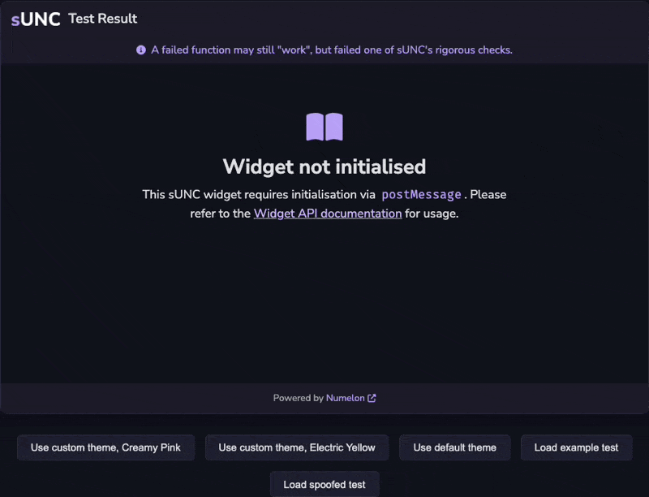

# Widget

The sUNC Embeddable Widget (SEW) allows you to embed sUNC test results as interactive widgets into other webpages via an `#!html <iframe>`. The widget is reusable and highly customiseable using it's [`#!ts postMessage` API](./postMessage-API/README.md).

This widget is ideal for developers who want to display sUNC results on status websites, show their score off on an executor website, or to use it in forums.

---

## Widget features

- Load any sUNC test result into a sandboxed viewer widget.
- Change the widget theme to match your website using a custom colour scheme.
- Dynamically control the widget through JavaScript using the [`#!ts postMessage` API](./postMessage-API/README.md).

---

## Example



You may view this example preview [here](./example/) or look at the [source code](https://github.com/sUNC-Utilities/docs.sunc.su/edit/main/docs/About/Integration-Suite/Widget/example).

---

## Usage

You can embed the widget using a standard `#!html <iframe>` and control it using the [`postMessage` API](./postMessage-API/README.md).

!!! info "A minimum height of `#!css 610px` is **recommended**, but not required."

```html title="Embedding the sUNC widget"
<iframe id="sunc-widget" src="https://sunc.rubis.app/widget/" allowfullscreen></iframe>
```

```html title="Sending a message to load a scrap (test result)"
<script>
  const iframe = document.getElementById("sunc-widget");

  iframe.contentWindow.postMessage({
    type: "sunc-widget:loadScrap",
    payload: {
      scrapId: "766F7uirM9D9ZlAF",
      key: "Hvj2XFk6nVJtJQQ9VtPoHoDpnxBDhesL"
    }
  }, "https://sunc.rubis.app");
</script>
```

Communicating with the widget may be done via the [`#!ts postMessage` API](./postMessage-API/README.md), and [message types are described here](./postMessage-API/MessageType.md).

---

## Optimisation Guide: A Persistent SEW

!!! info "A minimum height of `#!css 610px` is **recommended**, but not required."

If your site frequently uses the sUNC Embeddable Widget (SEW) - for example, to display many different results or support multiple themes (e.g., an executor comparison website) - then it is **highly recommended** that you **keep a persistent `#!html <iframe>`** in the DOM rather than dynamically creating and destroying it. In fact, the SEW was designed around this principle and is easier to use this way.

Instead of doing something like this:

```js title="The bad practice of dynamically creating a new iframe each time"
// do NOT do this!!
button.onclick = () => {
  const iframe = document.createElement("iframe")
  iframe.src = "https://sunc.rubis.app/widget/"
  document.body.appendChild(iframe)

  iframe.contentWindow.postMessage({ ... }, "https://sunc.rubis.app")
}
```

You should **ensure that the `#!html <iframe>` exists only once** - whether this is dynamically created or *already present* in your HTML - and keep it hidden by default (e.g., with Tailwind's `#!css hidden` class or `#!css display: none` in CSS). Then simply show, hide, or update it as needed:

```js title="Creating one persistent widget with the name of 'sunc-widget'"
<iframe id="sunc-widget" class="hidden" src="https://sunc.rubis.app/widget/"></iframe>
```

Then use the [`#!ts postMessage` API](./postMessage-API/README.md) to load different results or change the theme:

```js title="Using the postMessage API to load a different result"
iframe.contentWindow.postMessage({
  type: "sunc-widget:loadScrap",

  payload: {
    scrapId: "...",
    key: "..."
  }
}, "https://sunc.rubis.app");
```

### Why is this better?

Overall, using a persistent `#!html <iframe>` is better because of a few reasons:

1. Even if the widget might be cached by the browser, it does not need to re-initialise the `#!html <iframe>` every time.
2. Performance is slightly improved by avoiding unnecessary DOM churn and repeated `#!html <iframe>` creation.
3. Your state is perserved in the widget, meaning you can set a custom theme once and it will persist across result reloads.
4. If your site supports multiple themes (e.g., light/dark mode, seasonal themes like a halloween theme for example), then you can instantly update the widget using the [`#!ts postMessage` API](./postMessage-API/README.md) without waiting for the SEW to re-load, or having to maintain a separate state in your own code just to provide the SEW with your custom theme.
