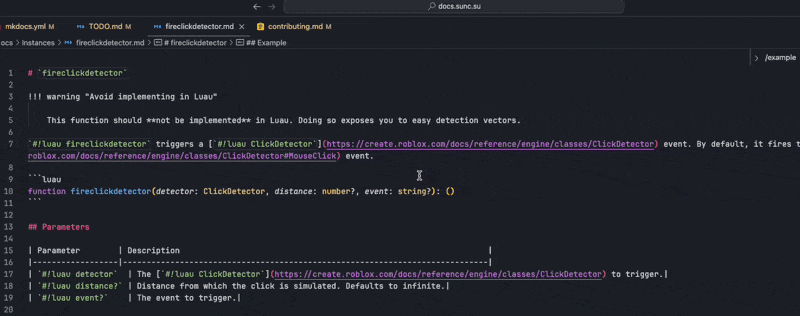

# Contribution Guide

Welcome to the sUNC documentation project! We worked tirelessly to standardise and make the documentation beautiful and readable for everyone.

This guide outlines the official standards for contributing to the sUNC documentation, including how libraries and functions should be structured and written.

Consistency makes the documentation readable, searchable, and enjoyable to explore.

---

## Documenting entire libraries

Each library **must** be placed in a folder named after the library itself. Inside this folder, you must include a `README.md` file, which serves as the **index page** for that library, in both this documentation website and also when browsing the documentation repository on GitHub.

### Index page requirements

- Introduce the purpose of the library
- Summarise what you **can** and **cannot** do with it

Index pages *do not* need to follow this strict format, but they should ***aim*** to do so, for clarity and helpfulness.

---

## General documentation style

All documentation pages (including function pages and index pages) **must**:

- Use inline links to relevant [Wikipedia](https://wikipedia.org), [Roblox Luau](https://create.roblox.com/docs), or other sUNC pages with referencing key terms.
- Use the correct inline link formats, e.g.:

    ```md
    [`#!luau task.defer`](https://create.roblox.com/docs/reference/engine/libraries/task#defer)
    ```

    As you can see, the example above uses a code snippet with `luau` syntax highlighting enabled, whilst also being a hyperlink to the Roblox API documentation for [`#!luau task.defer`](https://create.roblox.com/docs/reference/engine/libraries/task#defer).

All markdown documents must be formatted using David Anson's ["markdownlint"](https://marketplace.visualstudio.com/items?itemName=DavidAnson.vscode-markdownlint) extension, available for free in the Visual Studio marketplace.

This extension alone is not sufficient enough, which is why we use Yu Zhang's ["markdown all in one"](https://marketplace.visualstudio.com/items?itemName=yzhang.markdown-all-in-one) extension too, but only specifically for formatting tables. This makes tables look nice and readable in the source markdown files of the documentation.

The repository for this documentation already includes a `.vscode/extensions.json` file, so the extensions should automatically download for you once you consent.

When formatting tables, open the Command Palette with `Ctrl + Shift + P` (Windows) or `⌘ + Shift + P` (macOS), select "Format Document With...", and select "Markdown All In One" like so:



### Language choices

#### Using British English

It is generally well known around the sUNC community that the documentation and most things that have a lot of text are written using British English. This usually means some words Americans spell with a "z" will instead use an "s". If you are unsure, please check the Oxford or Cambridge dictionaries.

#### The "Oxford Comma"

Please use the [Oxford Comma](https://en.wikipedia.org/wiki/Serial_comma) when writing lists.  
This means that in a list of three or more items, a comma is placed before the final "and" or "or".  
For example: *"apples, oranges, and bananas"* rather than *"apples, oranges and bananas"*.  

The Oxford Comma avoids ambiguity and makes lists clearer. It also mirrors natural pauses in daily speech, which makes the text easier to read aloud and less confusing to follow.

#### Short-form contractions

Please avoid contractions like "isn't" and "it's". Instead, use "is not" and "it is" respectively. These are just examples, but the same rules apply for all contractions. Because this documentation is formal and technical rather than conversational, contractions should be avoided.

#### Articles before a word

An article is something that goes before a word, like `a` and `an`. This is a polite reminder to ***not*** just put an `an` in front of things that have a vowel *literally*, but rather whether the word has a vowel **sound** when pronounced out loud. Non-native English speakers tend to get this rule wrong sometimes.

If unsure about pronunciation, assume that pronunciation is done with a British RP accent - the best sources to listen to are the Oxford and Cambridge dictionaries again where the pronunciation is perfect.

---

## Function documentation

Each function must have **its own file**, named after the function (e.g. `newcclosure.md`).

### Title Format

The title of the page must be written as:

```md
# `function_name`
```

!!! failure "Important"

    Do not include emojis in function **titles**.

### Notices

Place all important `!!!` callouts (warnings, errors, info) **immediately under the title**. These should include anything the user must know before using the function.

---

### Description

Provide a description of the function directly after any notices.

When referencing the function name, **always** use the code snippet format:

```md
`#!luau function_name` allows you to do this and that.
```

---

### Type definition

!!! info "Type definitions are important!"

    You **must** always include a Luau-style type definition when documenting a function.

Include the Luau type definition **at the bottom of the first section**, with Luau syntax highlighting but **no *individual line highlighting* or line numbers**:

```luau
function newcclosure<A..., R...>(functionToWrap: (A...) -> R...): (A...) -> R...
```

Make sure it precedes the parameters table.

---

### Parameters

The parameters must always be neatly described in a function, like so:

```md
## Parameters

| Parameter               | Description                         |
|-------------------------|-------------------------------------|
| `#!luau parameter_name` | Short description of the parameter. |
```

Use [**snake_case**](https://en.wikipedia.org/wiki/Snake_case) for **every variable**, and [**camelCase**](https://en.wikipedia.org/wiki/Camel_case) for **parameters** to easily distinguish between the two.

There should be **no horizontal rule** (`---`) between the *type definition* and the *parameters* section.

---

### Providing users with examples

Every function page **must** include at least one example.

!!! info "Use 'Example' or 'Examples' based on how many examples you have"

    To make the documentation experience more logical and also grammatically correct, please do the following:
    - Make the heading `#!md ## Example` if there is only one example.
    - Make the heading `#!md ## Examples` if there is more than one example.
        Each example should have its own subheading, e.g. `#!md ### Example 1`, `#!md ### Example 2`.

Each example should use the following format:

````md
## Example

```luau title="Short but descriptive title for your code" linenums="1"
-- an example is here
print("Hello world!")
print("This is some example code")
```
````

- Examples must use `luau` syntax highlighting.
- Line numbers **must** be enabled using `linenums="1"`.
- Each example **must** have a `title` describing in short what the code does.
