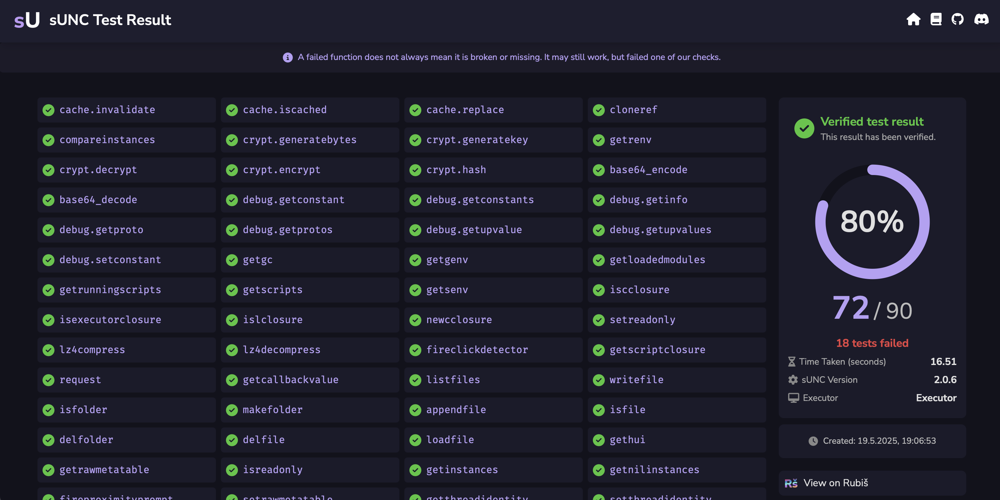

# How do test results work?

sUNC is known for its strict tests. Ever since it was made, it was built to expose falsified environments and spoofed globaly by testing for functionality - not just checking for their presence or shallow checking.

---

## Using the dedicated game

As of **sUNC V2**, all tests must be conducted in the official sUNC testing game. This game may be found in our [Discord server](https://discord.gg/FNNfTUpFYv).

We chose to do so, because by having a dedicated server, we're able to provide you with the new online test results via Rubiš. This allows us to provide you with verified and reproducible results, instead of people sending meaningless screenshots of their console output.

---

## Viewing your test results

Once your test is complete, sUNC will generate a short redirect link via `r.sunc.su` like this:

This generated link redirects to **Numelon Rubiš**:

The results page offers a clean, visually appealing UI that lays out which functions passed and which failed, why they failed, and cryptographic guarantees of authenticity.

---

## Verified integrity

Rubiš doesn't just store your sUNC test results, it also **verifies** them.

- Every result is **cryptographically signed** by the sUNC test game servers.
- Any tampered or faked data is **flagged as unverified**.

Even if someone tries to replicate the link or manually upload fake data and use it with the results viewer (since [Rubiš is also a public paste service](https://rubis.app) which is usable by anyone), it will not work.
